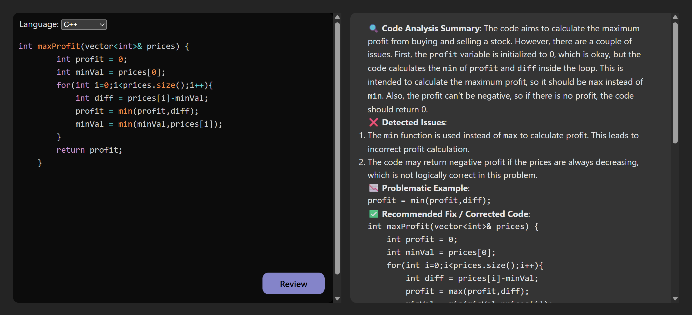
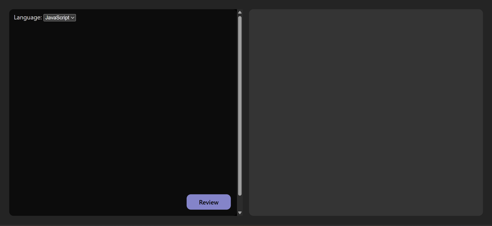

# Code Reviewer  


**AI-Powered Code Assistant**

## Overview  
Code Reviewer is a fast and intelligent web application that provides automated code reviews using AI. Designed to reduce manual effort and enhance developer productivity, it generates in-depth feedback in under 10 seconds across key categories such as performance, best practices, code quality, and potential bugs. The application features a real-time code editor with syntax highlighting, and integrates a powerful backend that communicates with the Gemini 2.0 Flash API using effective prompt engineering. 

## Features  
- **AI-Powered Code Review:** Instantly generates detailed feedback using Gemini 2.0 Flash API across multiple review categories.  
- **Real-Time Code Editor:** Interactive editor with syntax highlighting support for 3+ languages (JavaScript, Python, C++, etc.).  
- **High-Speed Reviews:** Delivers complete reviews in less than 5 seconds, reducing manual review time by ~90%.  
- **RESTful API Endpoint:** Built with Node.js and Express.js to handle prompt generation and interaction with Gemini API.  
- **Responsive UI:** Clean, modern interface built with React and Vite, designed for seamless use across devices.

## Technologies  
- **Frontend:** React.js, Vite 
- **Backend:** Node.js, Express.js  
- **AI API:** Gemini 2.0 Flash (via Google Generative AI SDK)  
- **Other Tools:** Git for version control, npm for package management

## Screenshots  





## Running with Docker
This project has two parts, each with its own Dockerfile.

Build and run the backend:
```bash
cd BackEnd
docker build -t code-reviewer-backend .
docker run -p 3000:3000 code-reviewer-backend
```

Build and run the frontend:
```bash
cd FrontEnd
docker build -t code-reviewer-frontend .
docker run -p 8080:80 code-reviewer-frontend
```
Visit `localhost:8080` in your browser for the frontend, which communicates with the backend at `localhost:3000`.

Note: you'll need your own `.env` file inside `BackEnd` with a Gemini API key for the backend to function, since `.env` is gitignored and not included in the image.

## CI/CD
A GitHub Actions workflow automatically validates the Docker build for both the backend and frontend on every push and pull request to `main`. See `.github/workflows/ci.yml`.